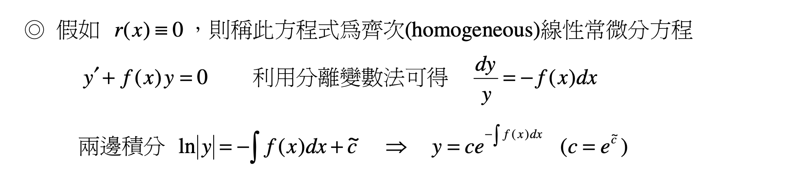

# Homework note

`I have help for ChatGPT`
`This page Not help GPT just note`

##  First-Order-11.jpg

the topic is First-Order Differential equation
in the topuc i have use the `Bernoulli's Principle`

### Bernoulli's Principle intodution

y'+f(x)y = r(x)
`this is Homogeneous from Bernoulli`
ex:

### Second-order-7.JPG

the topuc search the `Particular Solution`
by Second-Order Differential Equation 

### Sample Information
[wikipedia](https://zh.wikipedia.org/zh-tw/%E4%BC%AF%E5%8A%AA%E5%88%A9%E5%BE%AE%E5%88%86%E6%96%B9%E7%A8%8B)
[Bernoulli](https://erac.ntut.edu.tw/var/file/64/1064/img/585/128519740.pdf)